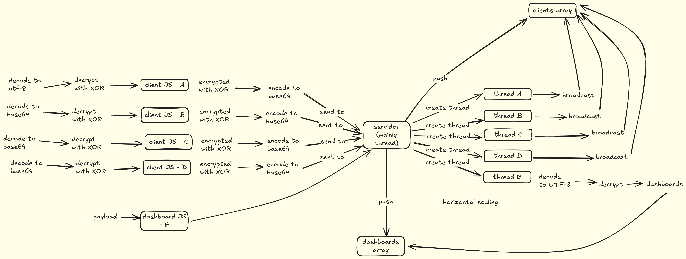

# Chat Seguro com WebSocket e Criptografia XOR

Sistema de chat em tempo real implementado com WebSocket puro (sem bibliotecas externas), utilizando sockets TCP e threading em Python. O projeto inclui criptografia XOR para comunicação segura e um dashboard para monitoramento de mensagens.

## 📋 Índice

- [Características](#características)
- [Arquitetura](#arquitetura)
- [Tecnologias Utilizadas](#tecnologias-utilizadas)
- [Pré-requisitos](#pré-requisitos)
- [Instalação](#instalação)
- [Uso](#uso)
- [Estrutura do Projeto](#estrutura-do-projeto)
- [Protocolo de Comunicação](#protocolo-de-comunicação)
- [Segurança](#segurança)

## ✨ Características

- **WebSocket Nativo**: Implementação completa do protocolo WebSocket sem dependências externas
- **Multithreading**: Suporte a múltiplos clientes simultâneos usando threads
- **Criptografia XOR**: Mensagens criptografadas com chave simétrica
- **Dashboard de Monitoramento**: Interface administrativa para visualizar mensagens em tempo real
- **Chat em Tempo Real**: Comunicação instantânea entre múltiplos usuários
- **Interface Responsiva**: Design moderno com modo escuro

## 🏗️ Arquitetura



O sistema é composto por três componentes principais:

1. **Servidor WebSocket** (`server.py`): Gerencia conexões, threads e broadcasting de mensagens
2. **Cliente Chat** (`index.html`): Interface do usuário para envio e recebimento de mensagens
3. **Dashboard** (`dashboard.html`): Painel administrativo para monitoramento e análise

### Fluxo de Comunicação

1. Cliente estabelece conexão WebSocket com o servidor
2. Servidor realiza handshake WebSocket
3. Cliente envia mensagem criptografada com XOR
4. Servidor descriptografa e faz broadcast para todos os clientes conectados
5. Dashboard recebe tanto versão criptografada quanto descriptografada para análise

## 🛠️ Tecnologias Utilizadas

### Backend
- **Python 3.x**
  - `socket`: Comunicação TCP/IP de baixo nível
  - `threading`: Gerenciamento de threads para múltiplos clientes
  - `hashlib`: Geração de hash SHA-1 para handshake WebSocket
  - `base64`: Codificação de chave de aceitação WebSocket
  - `struct`: Empacotamento de dados binários para frames WebSocket
  - `json`: Serialização de mensagens

### Frontend
- **HTML5**
- **CSS3** (Design responsivo com modo escuro)
- **JavaScript** (Vanilla JS - WebSocket API nativa)

## 📦 Pré-requisitos

- Python 3 ou superior
- Navegador web moderno com suporte a WebSocket (Chrome, Firefox, Edge, Safari)

## 🚀 Instalação

1. Clone o repositório:
```bash
git clone https://github.com/marcelomatheus/api-socket.git
cd api-socket
```

2. Nenhuma instalação de dependências é necessária, pois o projeto usa apenas bibliotecas padrão do Python.

## 💻 Uso

### Iniciando o Servidor

```bash
python server.py
```

O servidor iniciará em `127.0.0.1:8080`

### Acessando o Chat

1. Abra o arquivo `index.html` no navegador
2. Digite seu nome de usuário
3. Comece a enviar mensagens

### Acessando o Dashboard

1. Abra o arquivo `dashboard.html` no navegador
2. O dashboard conectará automaticamente ao servidor
3. Visualize mensagens criptografadas e descriptografadas em tempo real

### Múltiplos Usuários

Para testar com múltiplos usuários, abra `index.html` em várias abas ou navegadores diferentes.

## 📁 Estrutura do Projeto

```
api-socket/
├── server.py              # Servidor WebSocket com threading
├── index.html             # Interface do chat
├── dashboard.html         # Dashboard de monitoramento
├── architecture.excalidraw # Diagrama de arquitetura (fonte)
├── docs/
│   └── drawing.png       # Diagrama de arquitetura (imagem)
└── README.md             # Este arquivo
```

## 📡 Protocolo de Comunicação

### Tipos de Mensagens

#### 1. Registro de Cliente Chat
```json
{
  "type": "register_chat"
}
```

#### 2. Registro de Dashboard
```json
{
  "type": "register_dash"
}
```

#### 3. Mensagem de Chat
```json
{
  "type": "message",
  "user": "nome_usuario",
  "payload": "mensagem_criptografada"
}
```

#### 4. Log para Dashboard
```json
{
  "type": "log",
  "encrypted": "mensagem_criptografada",
  "decrypted": "mensagem_descriptografada",
  "user": "nome_usuario"
}
```

### Frame WebSocket

O servidor implementa o protocolo WebSocket RFC 6455:
- **Handshake**: Troca de chaves Sec-WebSocket-Key e Sec-WebSocket-Accept
- **Frame Format**: Suporte a payloads de até 65535 bytes
- **Masking**: Decodificação de mensagens mascaradas do cliente

## 🔐 Segurança

### Criptografia XOR

O sistema utiliza criptografia XOR com chave simétrica:
- **Chave**: `SEGREDOSUPERSECRETO`
- **Algoritmo**: XOR byte a byte com rotação de chave

⚠️ **Nota**: A criptografia XOR é adequada para fins educacionais. Para aplicações em produção, utilize algoritmos criptográficos robustos como AES.

### Considerações de Segurança

- Servidor escuta apenas em `localhost` (127.0.0.1)
- Para uso em produção, considere:
  - WSS (WebSocket Secure) com TLS/SSL
  - Autenticação de usuários
  - Rate limiting
  - Validação e sanitização de entrada
  - Criptografia forte (AES-256, ChaCha20)

## 🤝 Contribuindo

Contribuições são bem-vindas! Sinta-se à vontade para:
1. Fazer fork do projeto
2. Criar uma branch para sua feature (`git checkout -b feature/MinhaFeature`)
3. Commit suas mudanças (`git commit -m 'Adiciona MinhaFeature'`)
4. Push para a branch (`git push origin feature/MinhaFeature`)
5. Abrir um Pull Request

## 📝 Licença

Este projeto é de código aberto e está disponível para fins educacionais.

## 👥 Autor

**Marcelo Matheus**
- GitHub: [@marcelomatheus](https://github.com/marcelomatheus)

## 📞 Suporte

Para reportar bugs ou solicitar features, abra uma [issue](https://github.com/marcelomatheus/api-socket/issues) no GitHub.

---

⭐ Se este projeto foi útil para você, considere dar uma estrela no repositório!
